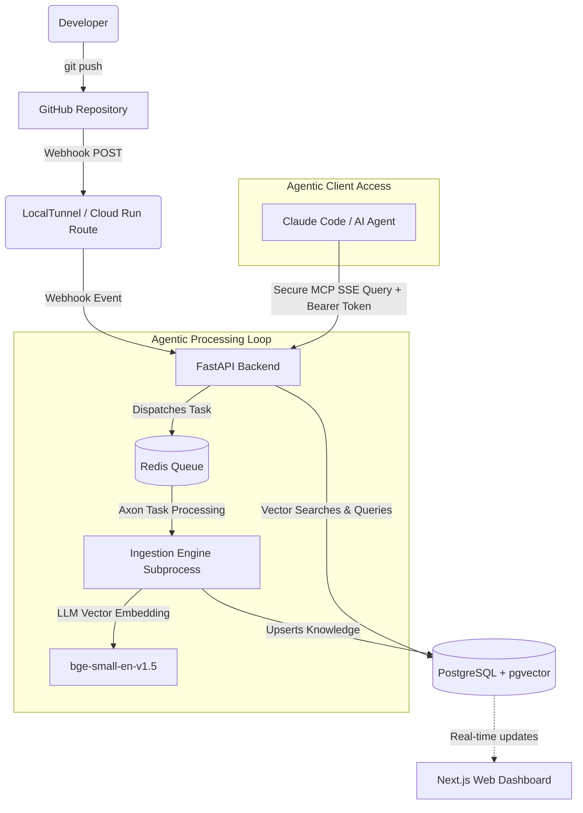

# Semantic Canvas: The Project Memory Layer

**Hackathon Submission — Agentic AI Edition 🤖🔥**

Semantic Canvas is a real-time, shared memory infrastructure explicitly designed to empower AI Agents. While most Agentic workflows suffer from hallucination or lack of team context, Semantic Canvas solves this by autonomously constructing and exposing a massive vector knowledge graph of architectural decisions, conventions, and relationships via the Model Context Protocol (MCP).

## 🧠 The Agentic Loop

Semantic Canvas operates as the unified infrastructural "Brain" for any downstream AI Agent workflow:

1. **Observe (Autonomous Ingestion):** Through autonomous GitHub Webhooks, the Agent continuously monitors the repository. 
2. **Reason (LLM Processing):** Using `BAAI/bge-small-en-v1.5` embeddings and local LLM processing, it parses syntax, determines function caller/callee relationships, and identifies structural modifications.
3. **Plan & Adapt (Decisions & Conventions):** The framework explicitly categorizes and tracks Architectural Decisions and "Blast Radiuses", automatically storing these in a PGVector database.
4. **Act (MCP Tools):** Utilizing the built-in MCP Server (via SSE Transport), downstream autonomous workflows (like Claude Code or PR Review Agents) securely query this knowledge base using tools like `mcp_semantic-canvas_search` or `mcp_semantic-canvas_log_decision`.

### Core Tools Used
- **LLM/Embeddings:** HuggingFace `sentence-transformers` &rarr; `BAAI/bge-small-en-v1.5`
- **Data Storage:** PostgreSQL 16 equipped with `pgvector`
- **MCP Server Protocol:** Securely mounted to FastAPI via Server-Sent Events (SSE) Transport
- **Queue/Workers:** Redis queue triggering isolated ingestion subsystems

---

## 📐 Architecture Diagram



---

## 📦 Runbook & Demo Setup

Follow these exact steps to run Semantic Canvas locally and demonstrate the autonomous agentic loop to the judges.

### 1. Start the Core Infrastructure
Spin up the `pgvector` knowledge graph and `redis` queue instances:
```bash
docker compose up -d postgres redis
```

### 2. Launch the "Semantic Brain" (FastAPI Backend)
To ensure the Local Task Queue can spawn the autonomous ingestion scripts using your native Python virtual environment, execute Uvicorn directly on the host (not in Docker):
```bash
cd packages/api
# Ensure your venv is activated here
uvicorn src.main:app --port 8000 --reload
```

### 3. Launch the Observability Dashboard
Allow the judges to visually inspect the knowledge graph and activity logs:
```bash
# In a new terminal tab
cd packages/web
pnpm dev
```
Open `http://localhost:3000` to view the UI.

### 4. Open the Webhook Tunnel (For Live Demonstrations)
To demonstrate the autonomous `Observe -> Ingest` loop when a developer pushes code:
```bash
# In a new terminal tab at the root
npx localtunnel --local-host 127.0.0.1 --port 8000
```
*Copy the generated `https://*.loca.lt` URL, append `/api/v1/webhooks/github`, and save it under your GitHub Repository's Webhook settings.*

### 5. Demonstrate the MCP Agent Action
1. Generate an API token from your local Next.js Web Dashboard under target Project Settings.
2. Ensure your local agent's MCP configuration (`.mcp.json` or `mcp_config.json`) points securely to:
   ```json
   "mcpServers": {
     "semantic-canvas": {
        "url": "http://localhost:8000/mcp/sse",
        "headers": {
          "Authorization": "Bearer <YOUR_GENERATED_TOKEN>",
          "X-Project-Id": "<YOUR_PROJECT_ID>"
        }
      }
   }
   ```
3. Run your preferred Agent (e.g., `claude` CLI).
4. **The Pitch Prompt:** *"Use the Semantic Canvas tools to tell me the architectural rules for the current project, and determine the blast radius if I were to change authentication methods."* 
5. The Agent will autonomously establish the SSE connection, verify the cryptographically hashed tokens, query the PGVector database, and output context-aware reasoning without any human micro-managing!
